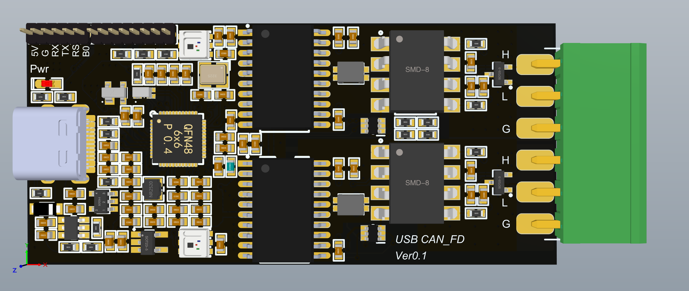

VCAN 是一款USB转2路CAN FD工具，基于HPM5361/HPM5321芯片设计。

## 展示

## 特性

- 支持2路CAN FD通道
- 支持配置120Ω终端电阻
- 每路通道均支持RGBW灯指示
- 绝缘电压高达5000Vrms
- 具有集成隔离式DC-DC电源
- 电源电压：4.5V至5.5V
- 带输入过压保护、短路保护

## 软件

- 不提供软件，硬件已经经过测试

